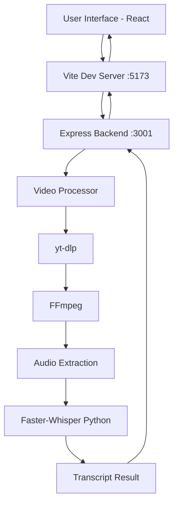
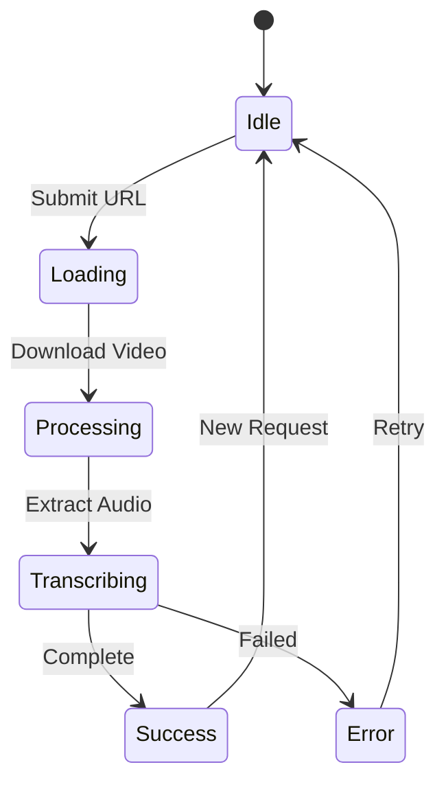

# Video Transcript Platform - Complete Implementation

A modern web platform that generates AI-powered transcripts from Instagram, YouTube, and TikTok videos using local faster-whisper model.

## 🏗️ Architecture Overview



## 📁 Project Structure

```
video-transcript-platform/
├── frontend/                 # React + Vite frontend
│   ├── src/
│   │   ├── components/
│   │   │   ├── TranscriptViewer.jsx
│   │   │   ├── TranscriptViewer.css
│   │   │   ├── PlatformDetector.jsx
│   │   │   └── PlatformDetector.css
│   │   ├── App.jsx
│   │   ├── App.css
│   │   ├── index.css
│   │   └── main.jsx
│   ├── index.html
│   ├── vite.config.js
│   └── package.json
├── backend/                  # Express.js backend
│   ├── server.js
│   ├── videoProcessor.js
│   ├── transcriptionService.js
│   ├── localTranscriptionService.js
│   ├── whisper_transcribe.py
│   └── package.json
└── README.md
```

## 🎨 Frontend Implementation

### 1. Design System ([index.css](file:///Users/dushyanth/Desktop/video-transcript-platform/frontend/src/index.css))

**Key Features:**
- **Dark Theme** with vibrant accent colors (#6366f1, #8b5cf6)
- **Glassmorphism** effects with backdrop blur
- **CSS Custom Properties** for consistent theming
- **Smooth Animations** and transitions
- **Custom Scrollbar** styling

**Color Palette:**
```css
--bg-primary: #0a0e1a
--accent-gradient: linear-gradient(135deg, #6366f1 0%, #8b5cf6 100%)
--text-primary: #f8fafc
```

### 2. Main App Component ([App.jsx](file:///Users/dushyanth/Desktop/video-transcript-platform/frontend/src/App.jsx))

**State Management:**
- `url` - Video URL input
- `loading` - Processing state
- `progress` - Progress percentage (0-100)
- `transcript` - Transcript result
- `error` - Error messages
- `platform` - Detected platform (youtube/instagram/tiktok)

**Key Functions:**
- `detectPlatform()` - Auto-detects platform from URL
- `handleSubmit()` - Sends transcription request to backend
- Progress simulation during processing

### 3. Transcript Viewer Component ([TranscriptViewer.jsx](file:///Users/dushyanth/Desktop/video-transcript-platform/frontend/src/components/TranscriptViewer.jsx))

**Features:**
- **Search Functionality** - Search within transcript with highlighting
- **Copy to Clipboard** - One-click copy
- **Export Formats:**
  - TXT - Plain text
  - SRT - Subtitle format
  - VTT - WebVTT format
- **Timestamped Segments** - Each line shows timestamp
- **Highlight Search Results** - Visual feedback

### 4. Platform Detector ([PlatformDetector.jsx](file:///Users/dushyanth/Desktop/video-transcript-platform/frontend/src/components/PlatformDetector.jsx))

Displays a badge showing detected platform with appropriate icon and color.

### 5. Vite Configuration ([vite.config.js](file:///Users/dushyanth/Desktop/video-transcript-platform/frontend/vite.config.js))

**Proxy Setup:**
```javascript
proxy: {
  '/api': {
    target: 'http://localhost:3001',
    changeOrigin: true
  }
}
```

## ⚙️ Backend Implementation

### 1. Express Server ([server.js](file:///Users/dushyanth/Desktop/video-transcript-platform/backend/server.js))

**Endpoints:**
- `GET /api/health` - Health check
- `POST /api/transcribe` - Main transcription endpoint

**Flow:**
1. Validate URL format
2. Detect platform (YouTube/Instagram/TikTok)
3. Call transcription service
4. Return transcript with segments

### 2. Video Processor ([videoProcessor.js](file:///Users/dushyanth/Desktop/video-transcript-platform/backend/videoProcessor.js))

**Key Functions:**

`downloadAndExtractAudio(url, platform)`
- Uses **yt-dlp** to download video
- Extracts audio using **FFmpeg**
- Returns path to MP3 file

**Process:**
1. Check yt-dlp installation
2. Download video in best audio format
3. Convert to MP3 if needed
4. Clean up temporary files

### 3. Transcription Service ([transcriptionService.js](file:///Users/dushyanth/Desktop/video-transcript-platform/backend/transcriptionService.js))

**Main Function:** `transcribeVideo(url, platform)`

**Steps:**
1. Check faster-whisper installation
2. Download and extract audio
3. Transcribe using local model
4. Clean up files
5. Return transcript

### 4. Local Transcription ([localTranscriptionService.js](file:///Users/dushyanth/Desktop/video-transcript-platform/backend/localTranscriptionService.js))

`transcribeWithFasterWhisper(audioPath)`
- Executes Python script
- Parses JSON output
- Returns transcript with segments

### 5. Python Whisper Script ([whisper_transcribe.py](file:///Users/dushyanth/Desktop/video-transcript-platform/backend/whisper_transcribe.py))

**Configuration:**
```python
model = WhisperModel("base", device="cpu", compute_type="int8")
```

**Features:**
- Voice Activity Detection (VAD)
- Word-level timestamps
- Beam search (size=5)
- Optimized for CPU with int8 quantization

**Output Format:**
```json
{
  "text": "Full transcript text",
  "language": "en",
  "duration": 123.45,
  "segments": [
    {
      "start": 0.0,
      "end": 5.2,
      "text": "Segment text"
    }
  ]
}
```

## 🔧 Dependencies

### Frontend
```json
{
  "react": "^18.3.1",
  "react-dom": "^18.3.1",
  "lucide-react": "^0.454.0",
  "vite": "^6.0.1"
}
```

### Backend
```json
{
  "express": "^4.21.2",
  "cors": "^2.8.5",
  "dotenv": "^16.4.7",
  "fluent-ffmpeg": "^2.1.3",
  "@ffmpeg-installer/ffmpeg": "^1.1.0"
}
```

### System Requirements
- **yt-dlp** - Video downloading
- **FFmpeg** - Audio extraction
- **Python 3** with **faster-whisper**

## 🚀 Running the Project

### 1. Start Backend
```bash
cd backend
npm start
```
Server runs on `http://localhost:3001`

### 2. Start Frontend
```bash
cd frontend
npm run dev
```
Frontend runs on `http://localhost:5173` (or 5174 if 5173 is in use)

## 💡 Key Features

### 1. **Multi-Platform Support**
- YouTube (`youtube.com`, `youtu.be`)
- Instagram (`instagram.com/reel`, `instagram.com/p`)
- TikTok (`tiktok.com/@user/video`)

### 2. **Local AI Processing**
- No API keys required
- Completely free
- Privacy-focused (all processing local)
- 4x faster than original Whisper

### 3. **Premium UI/UX**
- Dark mode with glassmorphism
- Smooth animations and transitions
- Responsive design
- Real-time platform detection
- Progress indicators

### 4. **Advanced Features**
- Timestamped transcripts
- Search functionality
- Multiple export formats
- Copy to clipboard
- Error handling

## 🎯 Model Options

Available models (configured in `whisper_transcribe.py`):
- `tiny` - ~75MB, fastest
- `base` - ~150MB, **default**
- `small` - ~500MB, better accuracy
- `medium` - ~1.5GB, high accuracy
- `large-v3` - ~3GB, best accuracy

## 📊 Data Flow

1. **User Input** → URL entered in frontend
2. **Platform Detection** → Auto-detect from URL pattern
3. **API Request** → POST to `/api/transcribe`
4. **Video Download** → yt-dlp downloads video
5. **Audio Extraction** → FFmpeg extracts MP3
6. **Transcription** → faster-whisper processes audio
7. **Response** → JSON with text and segments
8. **Display** → TranscriptViewer renders result

## 🔐 Error Handling

- URL validation
- Platform detection
- Dependency checks (yt-dlp, Python, faster-whisper)
- File size monitoring
- Cleanup on errors
- User-friendly error messages

## 🎨 UI Components

### Glass Card Effect
```css
background: rgba(26, 31, 53, 0.7);
backdrop-filter: blur(20px);
border: 1px solid rgba(148, 163, 184, 0.1);
```

### Button Ripple Effect
Animated ripple on hover using `::before` pseudo-element

### Progress Bar
Animated gradient with shimmer effect

### Platform Badges
Color-coded badges for each platform

## 📝 Export Formats

### TXT
Plain text, one line per segment

### SRT (SubRip)
```
1
00:00:00,000 --> 00:00:05,200
First segment text

2
00:00:05,200 --> 00:00:10,500
Second segment text
```

### VTT (WebVTT)
```
WEBVTT

1
00:00:00.000 --> 00:00:05.200
First segment text
```

## 🔄 State Management Flow



---

**Built with:** React, Vite, Express.js, faster-whisper, yt-dlp, FFmpeg
